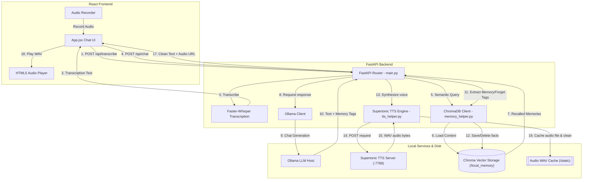

# 🕊️ Peace — Local Personal AI Companion

> A completely offline, private AI companion and guide. Built to listen, remember your personal history, provide empathetic support, and speak back to you—all running 100% locally on your machine with zero cloud dependencies, zero data logging, and absolute privacy.

[](#)
[](#)
[](#)
[](#)
[](#)

---

## ✨ Key Features

*   **🧠 Local Long-Term Memory (RAG):** Remembers details about your life, preferences, and feelings across conversations using a local vector database (**ChromaDB**) and SentenceTransformers.
*   **🎙️ Snappy Speech-to-Text:** Transcribes your voice offline in less than a second using **Faster-Whisper** with CPU threads and INT8 quantization.
*   **🗣️ Natural offline Voice (Supertonic):** Speaks back using a local **Supertonic TTS server** on port 7788 (supports multiple warm male/female voice payload profiles) with a fallback to native browser SpeechSynthesis.
*   **🔇 Instant "Thinking" Voice:** Plays a pre-synthesized *"Hmm, let me think about that..."* voice clip instantly in the assistant's voice style when you submit a message, masking local LLM inference latency.
*   **⚙️ Custom Models & Paths Manager:** Select, download, and manage your local Ollama models (like Qwen or Gemma) directly from the settings drawer, and custom-configure which storage drive/folder (e.g. `D:\OllamaModels`) to store them on.
*   **🔒 100% Private & Local:** No external API keys, cloud subscriptions, or remote logging. Your data never leaves your hard drive.
*   **🛡️ Headless launcher:** Launch the backend, frontend, and voice servers silently in the background with a single double-click of [run_peace.bat](run_peace.bat). Cleanup and shutdown are handled with one click!

---

## 🛠️ The Tech Stack

### Frontend (User Interface)
*   **React 19 & Vite:** A sleek, glassmorphic conversational dashboard interface.
*   **Microphone Recorder & Visualizer:** Audio waves animate dynamically on microphone frequency analysis while recording.
*   **Audio Queue Manager:** Handles the playback of the synthesized speech WAV files and pre-generated thinking clips.

### Backend (Orchestration & AI Engines)
*   **FastAPI (Python 3.10+):** Exposes high-performance async REST routes (`/api/chat`, `/api/transcribe`, `/api/memories`, `/api/shutdown`).
*   **ChromaDB Vector Client:** Encodes facts into 384-dimensional arrays using `all-MiniLM-L6-v2` embeddings, and retrieves relevant context using **Squared L2 Euclidean Distance**.
*   **Ollama Server Host:** Runs your local LLM (recommended: `qwen2.5:0.5b`, `qwen2.5:1.5b`, or `gemma4:e4b` for reasoning).
*   **Faster-Whisper:** Runs local voice-to-text transcriptions with optimized VAD (Voice Activity Detection).
*   **Supertonic TTS Client:** Synthesizes voice audio payloads on port `7788` and performs automatic 3-file audio WAV garbage collection on disk.

---

## 📐 Headless Architecture Diagram



---

## 🚀 Getting Started

### 📋 Prerequisites
Ensure you have the following installed:
*   [Python 3.10+](https://www.python.org/downloads/)
*   [Node.js & npm](https://nodejs.org/en/download/)
*   [Ollama](https://ollama.com/) (Must be installed and running in your system tray)

### 📦 Manual Setup

1.  **Clone this Repository:**
    ```bash
    git clone https://github.com/rohitpadile/Local-Personal-AI-Assistant.git
    cd Local-Personal-AI-Assistant
    ```

2.  **Setup Backend & Dependencies:**
    ```bash
    cd backend
    python -m venv .venv
    .venv\Scripts\activate
    pip install -r requirements.txt
    ```

3.  **Setup Frontend & Dependencies:**
    ```bash
    cd ../frontend
    npm install
    ```

---

## ⚡ Running Headlessly in 1 Click

To start the application, simply double-click the **[run_peace.bat](run_peace.bat)** script in the root directory.

It will automatically:
1.  **Clean up** any leftover background servers running on ports `7788`, `8000`, or `5173`.
2.  **Launch headlessly** (completely silent, no command prompts cluttering your screen):
    *   Supertonic TTS Server (`port 7788`)
    *   FastAPI backend (`port 8000`)
    *   Vite frontend dev server (`port 5173`)
3.  **Open the Browser** to `http://localhost:5173` automatically.

### 🛑 Shutting Down
To close the application:
1.  Open the **Settings drawer** (gear icon ⚙️ at the top right of the browser page).
2.  Click the red **Terminate All Servers** button.
3.  Both the backend, frontend, and voice servers will be killed instantly, freeing all system memory.

---

## 📖 Learn More
*   Read the [SYSTEM_DESIGN.md](SYSTEM_DESIGN.md) for detailed program structure and logic flow.
*   Read the [RAG_GUIDE.md](RAG_GUIDE.md) to learn how retrieval works and how we can expand Peace to read entire textbooks or personal diaries.

---

## 📝 License
This project is licensed under the MIT License. See the [LICENSE](LICENSE) file for details.
