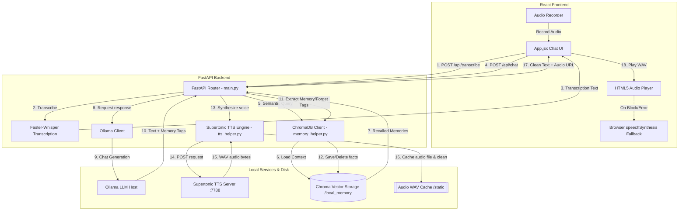

# 📐 Project Peace - System Design & Architecture

Welcome to **Peace**! This document provides a comprehensive system design overview of your private, offline AI companion. It details the architecture, data flows, Whisper configurations, local Supertonic TTS port settings, and explains exactly how the semantic vector database operations function under the hood.

---

## 1. System Overview

**Peace** is a deeply personalized, offline AI companion and life guide. It is designed to provide emotional support, comforting parenting guidance, and wise advice in response to user thoughts. 

### Key Capabilities
- **Offline Conversation:** Runs completely locally on the user's machine (FastAPI + React + Ollama).
- **Bidirectional Memory Loop:** Learns facts about the user (`<remember>` tags) and automatically forgets them (`<forget>` tags) via natural chat.
- **Voice Interactions:** Records voice input (Whisper transcription) and responds using high-quality local speech synthesis (**Supertonic**) or web browser fallback.
- **Optimized Performance:** Whisper CPU optimization (int8, 4 threads, greedy decoding) ensures responses are processed in under 2 seconds.
- **Strict Privacy:** Zero cloud connections. Your most personal thoughts never leave your desktop.

---

## 2. Technical Stack & Core Concepts

### A. The Local AI Engine (Ollama)
Ollama runs in the background as a local model host. In Project Peace:
- We use **Qwen 2.5 (1.5B or 3B)** or **Llama 3.1 (8B)** to generate empathetic dialogue.
- The model is instructed via a **System Prompt** to act as a comforting, wise mentor and parental figure.
- The system automatically serves and launches Ollama headlessly on port `11434` when the backend starts.

### B. Offline Speech-to-Text (Faster-Whisper)
Faster-Whisper is a highly optimized re-implementation of OpenAI's Whisper model using CTranslate2.
- **Quantization:** Uses `compute_type="int8"` (8-bit integer quantization) to speed up CPU inference by 4x–8x and cut RAM usage in half with negligible loss in accuracy.
- **Multicore Parallelism:** Utilizes `cpu_threads=4` to leverage multicore CPU architectures.
- **Decoding:** Uses greedy decoding (`beam_size=1`) for instantaneous transcription (under 1–2 seconds).
- **VAD Filter:** Enables Voice Activity Detection (`vad_filter=True`) to automatically crop silence and background noise before transcribing.

### C. Offline Speech Synthesis (Supertonic)
Supertonic runs as a local HTTP service on port `7788`.
- The backend takes the AI's response text and makes a local `POST` request to `http://127.0.0.1:7788/v1/audio/speech`.
- It dynamically passes the chosen user voice parameter (e.g., `F1` for female, `M4` for caring male style).
- **Audio Garbage Collector:** On every generation, the backend scans the cache folder `backend/static/` and automatically keeps only the **3 most recent speech files**, purging the rest to save disk space.
- **Fail-Safe Fallback:** If Supertonic is offline or returns an error, the frontend automatically falls back to the browser's built-in **Web Speech API (`speechSynthesis`)**, ensuring the app always speaks.

---

## 3. Detailed Semantic Vector Search Flow (ChromaDB)

ChromaDB is a lightweight vector database. Instead of traditional SQL queries that look for exact keyword matches, ChromaDB matches queries based on **semantic meaning** (concepts).

Here is the exact flow of how a semantic memory is found and forgotten under the hood:

```
[ User Input ] ---> "Forget that I enjoy singing songs"
                         │
                         ▼
1. [ Ollama LLM ] generates text ending with: "<forget>User likes singing songs</forget>"
                         │
                         ▼
2. [ Regex Parser ] extracts target query string: "User likes singing songs"
                         │
                         ▼
3. [ Embedding Generator ] converts text into a 384-dimensional floating-point array
   - Model: all-MiniLM-L6-v2 (SentenceTransformer running locally)
   - Text "User likes singing songs" ===> Vector Q [0.12, -0.45, ..., 0.08] (384 numbers)
                         │
                         ▼
4. [ Vector Similarity Comparison ] (Squared L2 Distance Operation)
   - ChromaDB compares Vector Q against all stored vectors in the DB.
   - Equation: Distance^2 = Σ (Q_i - DB_i)^2
                         │
                         ▼
5. [ Query Output ] returns the closest match:
   - Match: "Rohit enjoys singin' songs"
   - Match ID: "uuid-4a87-..."
   - L2 Distance: 0.18 (Very close semantic match!)
                         │
                         ▼
6. [ Deletion Trigger ] calls collection.delete(ids=["uuid-4a87-..."])
                         │
                         ▼
[ DB Updated ] (The memory is deleted from storage and disappears from UI)
```

### Distance Metrics
By default, ChromaDB uses **Squared L2 Distance (Euclidean)**.
*   **Distance = 0.0:** Exact vector coordinate match.
*   **Distance < 0.4:** High semantic similarity (similar concepts, different words).
*   **Distance > 0.8:** Low similarity (unrelated concepts).

---

## 4. High-Level Architecture Diagram



---

## 5. Directory Structure & Key Files

-   **`backend/memory_helper.py`:** Initializes the ChromaDB Persistent Client. Manages adding, querying (Squared L2 Distance), listing, and deleting memories.
-   **`backend/tts_helper.py`:** Interfaces with `supertonic` TTS on port 7788, manages custom voice style payload selection, and handles automatic 3-file audio WAV garbage collection.
-   **`backend/main.py`:** Runs FastAPI. Defines `/api/transcribe` for voice parsing, `/api/chat` for Ollama and memory loops, and `/api/memories` for dashboard curation.
-   **`frontend/src/App.jsx`:** React dashboard. Implements a beautiful conversational feed, handles microphone input and audio visualizer, manages custom models and drive location paths, and displays stored memories.
