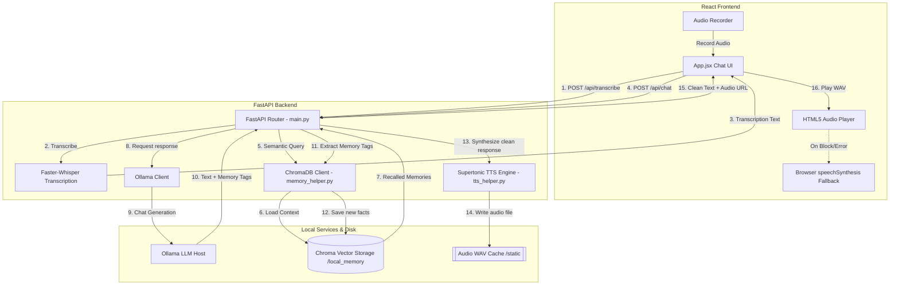

# 📐 Project Peace - System Design & Architecture

Welcome to **Peace**! This document provides a comprehensive system design overview of your private, offline AI companion. It explains the core technologies, design choices, data schemas, and conversational flow so any developer can understand how it works in seconds.

---

## 1. System Overview

**Peace** is a deeply personalized, offline AI companion and life guide. It is designed to provide emotional support, comforting parenting guidance, and wise advice in response to user thoughts. 

### Key Capabilities
- **Offline Conversation:** Runs completely locally on the user's machine (FastAPI + React + Ollama).
- **Long-Term Memory:** Remembers personal details (likes, emotional history, important facts) across sessions using **ChromaDB**.
- **Voice Interactions:** Records voice input (Whisper transcription) and responds using high-quality local speech synthesis (**Supertonic**) or web browser fallback.
- **Strict Privacy:** Zero cloud connections. Your most personal thoughts never leave your desktop.

---

## 2. Technical Stack & Core Concepts

### A. The Local AI Engine (Ollama)
Ollama runs in the background as a local model host. In Project Peace:
- We use **Qwen 2.5 (1.5B or 3B)** or **Llama 3.1 (8B)** to generate empathetic dialogue.
- The model is instructed via a **System Prompt** to act as a comforting, wise mentor and parental figure.

### B. The Vector Database (ChromaDB)
Instead of a traditional database (like SQLite which only does exact-word matching), Peace uses **ChromaDB**, an open-source, lightweight vector database.
- **What is a Vector Database?** When you speak to Peace, it converts your words into a list of numbers representing the *meaning* (semantic embedding).
- **How memory works:** When you say *"I'm feeling down about my job today,"* the system does a vector search in ChromaDB. It retrieves past events where you felt down, or details about your job, and passes them to the AI as "context" so Peace remembers you.
- **Storage Path:** Persisted locally inside the `backend/local_memory/` folder.

### C. Offline Speech Synthesis (Supertonic)
Supertonic is an open-source, extremely fast offline Text-to-Speech (TTS) system.
- The backend takes the AI's response text and calls Supertonic to synthesize a warm, natural `.wav` voice file.
- The audio files are stored in `backend/static/` and streamed to the React frontend.
- **Fail-Safe Fallback:** If Supertonic fails to load or is missing on the system, the frontend automatically falls back to the browser's built-in **Web Speech API (`speechSynthesis`)**, ensuring the app always speaks.

---

## 3. High-Level Architecture Diagram



---

## 4. The Memory Extraction Loop (Single-Pass)

Rather than running a second LLM query to extract memories, Peace uses a **Single-Pass Tag Extraction** mechanism inside the system prompt:

1. The System Prompt instructs the LLM: 
   *"If the user shares personal details, feelings, or history, output what you want to remember inside `<remember>...</remember>` tags at the end of your response."*
2. **Backend Parsing:** When Ollama returns the text, the FastAPI backend uses a Regular Expression (Regex) to extract the text inside these tags:
   ```python
   remember_pattern = re.compile(r'<remember>(.*?)</remember>', re.DOTALL)
   new_memories = remember_pattern.findall(llm_text)
   ```
3. The extracted facts are saved into **ChromaDB** with a timestamp metadata, and the tags are stripped from the response text before sending it to the user.

---

## 5. Directory Structure & Key Files

-   **`backend/memory_helper.py`:** Initializes the ChromaDB Persistent Client. Manages adding, querying, listing, and deleting memories.
-   **`backend/tts_helper.py`:** Interfaces with `supertonic` TTS, manages speech synthesis caching, and handles Hindi/English locale detection.
-   **`backend/main.py`:** Runs FastAPI. Defines `/api/transcribe` for voice parsing, `/api/chat` for Ollama and memory loops, and `/api/memories` for dashboard curation.
-   **`frontend/src/App.jsx`:** React dashboard. Implements a beautiful conversational feed, handles microphone input and audio visualizer, manages message history, and displays stored memories.
